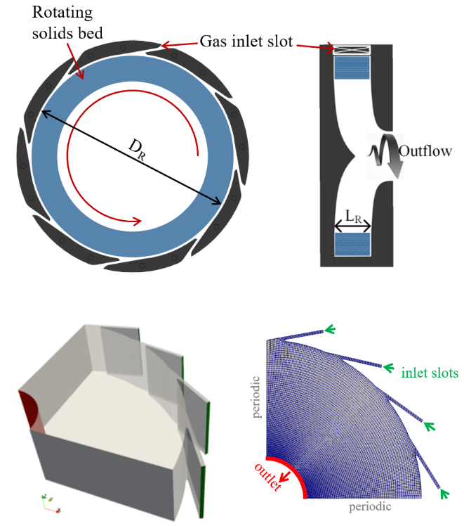

# GSVR tutorial (2D)

The catchyMultiphaseEulerFoam  solver
is used to simulate a gas-solid vortex reactor (GSVR) for OCM. 

In the GSVR, gas is injected tangentially via a number of inlet slots (see figure below).
The swirling gas transfers its momentum to the particles in the reactor chamber, 
which in turn start rotating. A fluidized state is obtained when the drag force 
exerted by the gas balances the apparent weight of the particles in the centrifugal force field. 
In contrast to gravitational fluidized beds, higher gas throughput, 
lower residence time, more uniform beds, higher slip velocities and hence better 
heat and mass transfer can be achieved in this reactor type. 

## Case description

This tutorial considers a 2D isothermal simulation of a GSVR with 16 inlet slots.

First, the hydrodynamics are calculated while the chemistry is still disabled. 
The solids are fed in a ring shaped volume near the circumferential wall of the
reactor chamber (defined in *system/topoSetDict*). 
They are fed in this ring via a numerical source term, as specified in *constant/fvOptions*. 
A residence time distribution is constructed by solving a scalar transport 
equation for tau.gas (using the 'phaseScalarTransport' functionObject).

Next, the OCM chemistry is enabled. 
The segregated chemistry approach is used. 
Mass transfer is modeled using a film model with mass transfer 
coefficient from an analogy with the Gunn correlation for heat transfer. 

For convenience, the most important case settings in terms of operating 
conditions are bundled in *system/caseSettings* and should only 
be adjusted by the user in that file.

## Instructions

The case can be run by executing `./Allrun` from the case directory.
The case directory is cleaned via `./Allclean`.