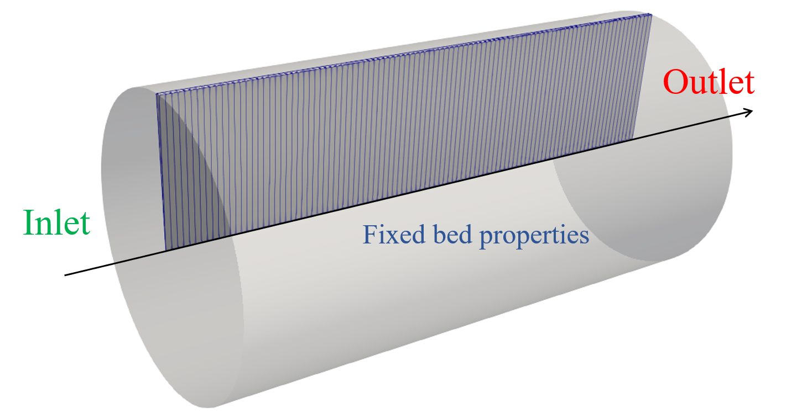

All validation cases in this folder use the
<span style="font-family:Courier;">catchyMultiphaseEulerFoam</span> 
solver. 

## Instructions

Each tutorial can be run by executing `./Allrun` from the case directory. If 
Cantera is installed, the simulations can be compared with a 1D plug flow reactor 
simulation by executing `python3 validate.py`. 
The case directory is cleaned via `./Allclean`.

To clean, run and validate all 
<span style="font-family:Courier;">catchyMultiphaseEulerFoam</span> 
tutorials in this folder:
```
./Allclean
./Allrun
./Allvalidate
```

## Case description

To validate the implementation of the kinetics and the multiphase reactive framework, 
1D simulations of a packed bed reactor are performed. The boundary conditions and 
simulation settings are chosen such as to resemble ideal plug flow behavior as closely 
as possible. This allows a comparison with Cantera simulations of a 1D pseudo-homogeneous 
plug flow reactor.

The geometry and computational grid used for this validation study are shown below. 
A cylindrical packed bed reactor is considered, which allows to use a wedge-type grid. 
Furthermore, only one cell is considered in the radial direction, turning the case into a 1D problem.
 

**isothermalGasonly** Isothermal 1D packed bed reactor with inert particles. 
Only gas phase reactions are considered (chemistry is disabled in 
*chemistryProperties.particles*).

**isothermalCoupled** Isothermal 1D packed bed reactor with reactions in both 
the gas phase and particles phase. The coupled chemistry approach is used, by
disabling the chemistry in *chemistryProperties.gas* and using the 
'twoPhaseAlpha' option in *chemistryProperties.particles*. No mass transfer 
resistances are considered.

**isothermalSegregated** Isothermal 1D packed bed reactor with reactions in both 
the gas phase and particles phase. The segregated chemistry approach is used.
No mass transfer resistances are considered.

**isothermalSegregatedMassTransfer** Isothermal 1D packed bed reactor with 
reactions in both the gas phase and particles phase. The segregated chemistry 
approach is used. Mass transfer is modeled using a film model with mass transfer 
coefficient from an analogy with the Gunn correlation for heat transfer.

**adiabaticCoupledSolidheat** Adiabatic 1D packed bed reactor with reactions in 
both the gas phase and particles phase. The coupled chemistry approach is used. 
No mass transfer resistances are considered. All reaction heat is generated in 
the particles phase.

**adiabaticCoupledGasheat** Adiabatic 1D packed bed reactor with reactions in 
both the gas phase and particles phase. The coupled chemistry approach is used. 
No mass transfer resistances are considered. All reaction heat is forced to be
generated in the gas phase, by enabling the 'multiphaseReactionHeat' option 
(default: off) in the *reactiveGasExchange* dictionary in *phaseProperties*.

**adiabaticSegregatedMassTransfer** Adiabatic 1D packed bed reactor with 
reactions in both the gas phase and particles phase. The segregated chemistry 
approach is used. Mass transfer is modeled using a film model with mass transfer 
coefficient from an analogy with the Gunn correlation for heat transfer. 


*More information can be found in Chapter 5 of my PhD thesis:*
*Laurien Vandewalle (2020),* 
*"Process intensification of oxidative coupling of methane"* 
*(available for download [here](https://biblio.ugent.be/publication/8663163)).*